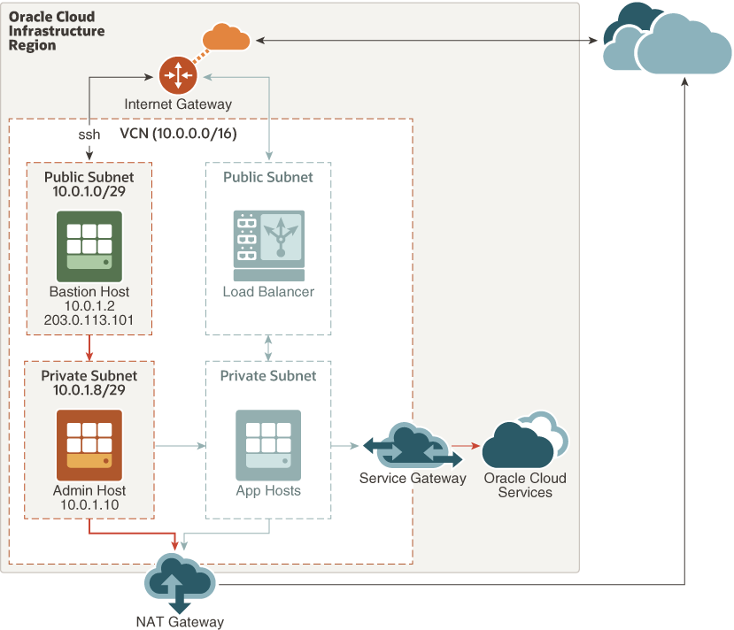

# A Linux Compute Instance in Oracle Cloud

## Solution Overview

Oracle Cloud Infrastructure Compute offers significant price-performance and control improvements compared to on-premise data centers, while providing the elasticity and cost savings of the public cloud. Oracle has a longstanding reputation for providing technologies that empower enterprises to solve demanding business problems—and Oracle Cloud Infrastructure is the first cloud that's purpose-built to enable enterprises to run business-critical production workloads.

This solution template allows you to deploy an Oracle Linux virtual machine in Oracle Cloud.

## Architecture

## Steps

Use the menu on the right to run the steps.

- **Before You Begin**
- **Provision Resources**
- **Validate Provisioning**
